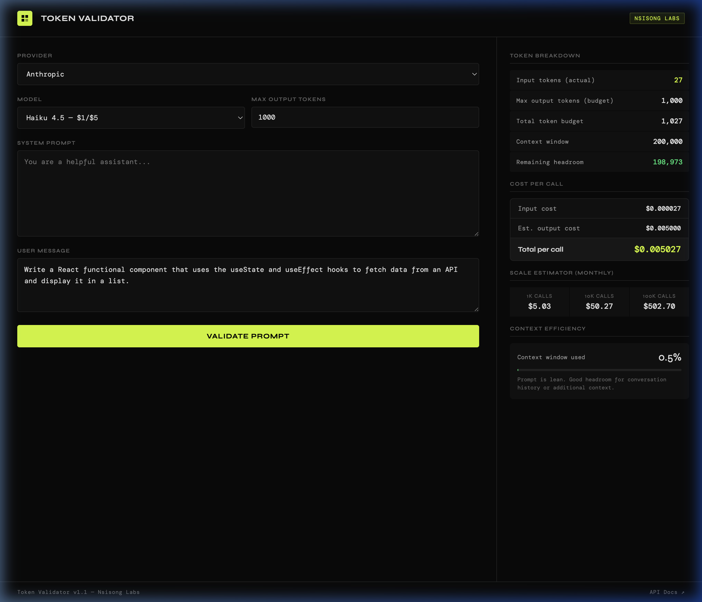
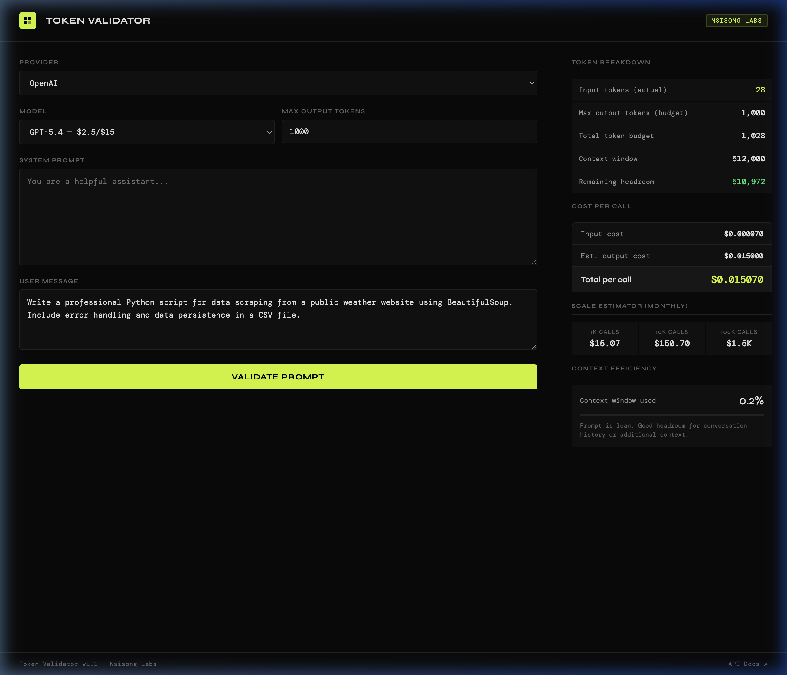
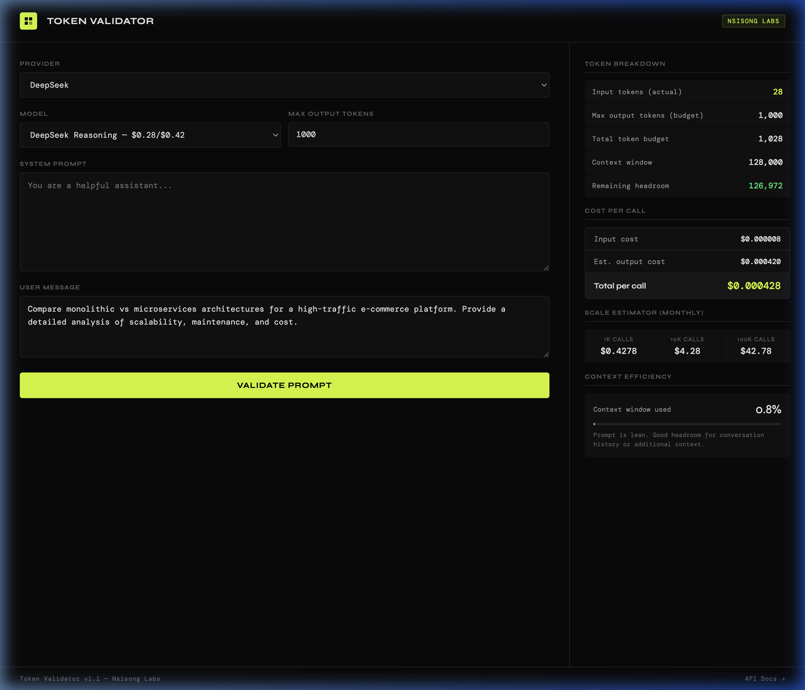
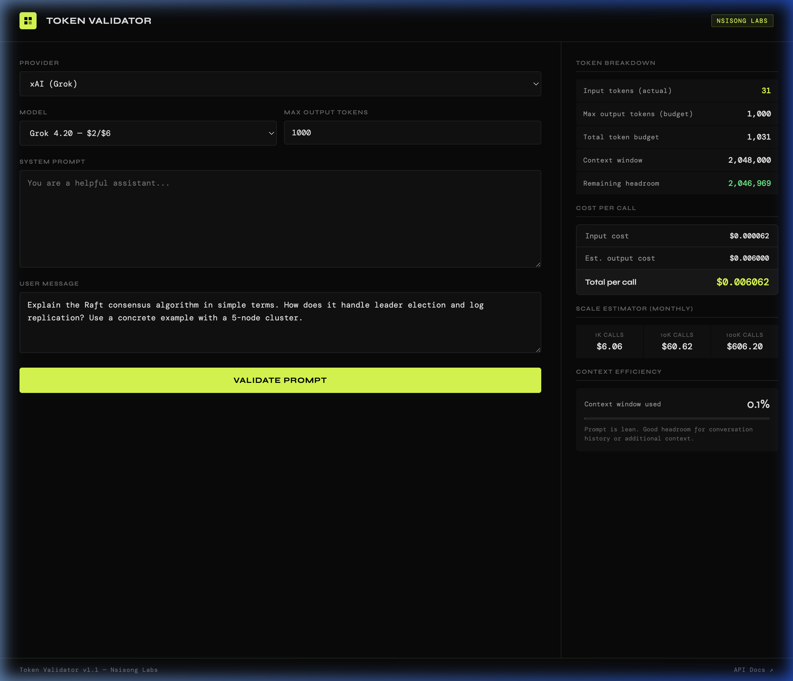

# Token Validator ⬡

A premium, high-performance LLM token counter and cost estimator supporting **11+ major providers**. Built for developers who need precise pricing and context window validation **without the hassle of API keys**.

Live at: **[tokenvalidator.nsisong.com](https://tokenvalidator.nsisong.com)**

## 🚀 Key Features

- **Zero-Config Validation**: No API keys required. Calculate tokens and costs instantly for all 11 providers.
- **Representative Examples**: Optimized for **coding assistance** and **complex reasoning** prompts.
- **Client-Side Tokenization**: Uses `gpt-tokenizer` to calculate tokens locally—100% private and offline-capable.
- **Real-Time Cost Estimation**: Instant calculation of input, output, and total per-call costs based on the latest 2026 pricing.
- **Context Efficiency**: Visual bar-track showing how much of the model's context window your prompt consumes.

## 📸 Screenshots (Coding & Reasoning)

````carousel

<!-- slide -->

<!-- slide -->

<!-- slide -->

````

## 🛠 Tech Stack

- **Frontend**: Vanilla HTML5, CSS3 (Glassmorphism & Flexbox), Modern JavaScript (ES6+).
- **Tokenization**: `gpt-tokenizer` (via CDN). Works locally for all models.
- **Deployment**: Automatic CI/CD from GitHub to **Cloudflare Pages**.

## 📖 How it Works

1. **Select Provider**: Choose from the dropdown (Anthropic, OpenAI, DeepSeek, etc.).
2. **Enter Prompt**: Fill in your system and user messages.
3. **Validate**: Hit "Validate Prompt". The tool calculates tokens locally and provides a full cost breakdown immediately.

---
Built by **Nsisong Labs**